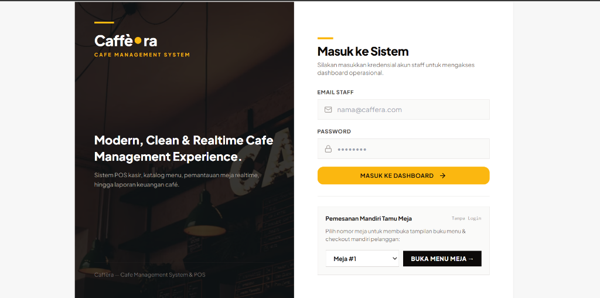
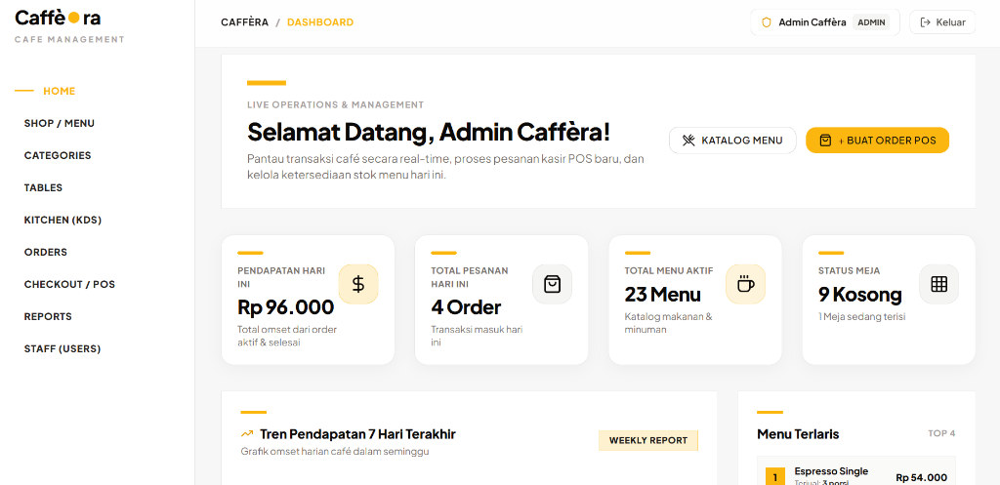
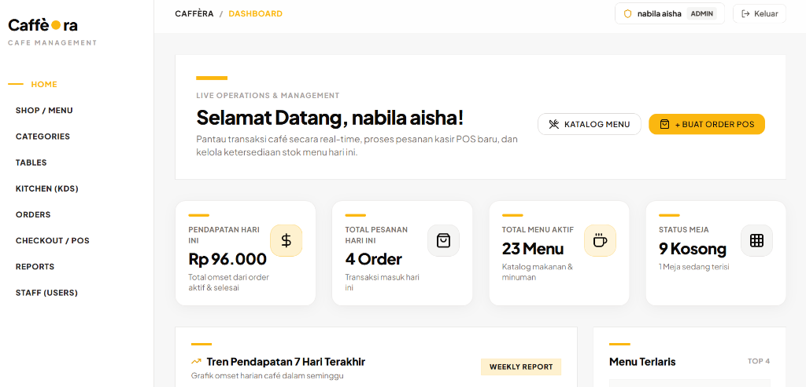
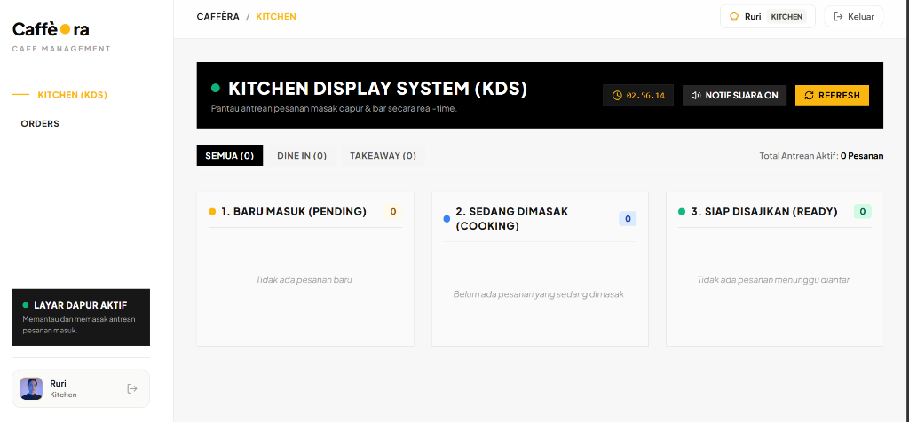

# ☕ Caffèra — Cafe Management System & Realtime POS

> **Platform Manajemen Café & Point of Sale (POS) Modern, Bersih, dan Real-time**  
> Proyek Ujian Akhir Semester (UAS) — *React Fundamental & Fullstack Web Application*

---

## 🔗 Link Tautan & Repositori

- 🚀 **Live Demo Web App:** [https://mycaffera.vercel.app/login](https://mycaffera.vercel.app/login)
- 📦 **GitHub Repository:** [https://github.com/azharfarizi27-creator/React-Fundamental](https://github.com/azharfarizi27-creator/React-Fundamental)
- 📂 **Subfolder UAS:** [React-Fundamental/Uas](https://github.com/azharfarizi27-creator/React-Fundamental/tree/main/Uas)
- 🎥 **Video Demo Pesan QR (Lokal):** `Record-Menu-Lewat-QR.mp4`
- 🎬 **Video Presentasi Lengkap (Google Drive):** [Tonton / Download Video Presentasi](https://drive.google.com/file/d/11IrLsYgZsLkNkGJQKPLAvMzP2r707SsV/view?usp=sharing)

---

## 🔑 Akun Demo Login (Kredensial Staff)

| Role | Email | Password | Hak Akses & Fitur |
| :--- | :--- | :--- | :--- |
| 👑 **Admin** | `admin@caffera.com` | `admin123` | Akses penuh: Dashboard Analytics, POS Kasir, Kelola Menu, Kategori, Meja & QR, Kitchen Display, Laporan Penjualan, Manajemen Akun Staff. |
| 👤 **Cashier** | `cashier@caffera.com` | `cashier123` | Akses operasional: POS Kasir (Checkout), Katalog Menu, Status Meja, dan Riwayat Order. |
| 🍳 **Kitchen** | `kitchen@caffera.com` | `kitchen123` | Akses khusus dapur: Kitchen Display System (KDS) Live Order Queue & status masak pesanan. |

> 📱 **Pemesanan Mandiri Tamu Meja (Tanpa Login):**  
> Pelanggan dapat langsung memilih nomor meja di halaman login atau membuka tautan: `https://mycaffera.vercel.app/table-order/1` untuk memilih menu dan checkout mandiri.

---

## a. 📖 Nama dan Deskripsi Aplikasi

**Caffèra** adalah aplikasi manajemen operasional café dan sistem kasir (*Point of Sale / POS*) berbasis web modern. Aplikasi ini dirancang untuk mendigitalkan seluruh alur kerja café secara *end-to-end*, meliputi:
1. **Pemesanan Mandiri Pelanggan (*Customer Self-Order*):** Tamu meja dapat memesan makanan/minuman secara mandiri melalui pemindaian QR Code meja tanpa perlu antre di kasir.
2. **Terminal Kasir Cepat (*POS Checkout*):** Kasir dapat memproses transaksi dengan kalkulasi otomatis pajak (PB1 10%), diskon menu spesial, berbagai metode pembayaran (Cash, QRIS, Transfer, Debit), dan cetak struk belanja.
3. **Layar Antrean Dapur Realtime (*Kitchen Display System - KDS*):** Membantu koki dan barista memantau pesanan masuk secara real-time dengan status antrean bertahap dan audio notifikasi.
4. **Analitik & Manajemen Bisnis:** Dashboard eksekutif yang menampilkan grafik tren penjualan harian, produk terlaris (*best seller*), ketersediaan stok, tata letak meja, serta laporan riwayat penjualan.

---

## b. 🌟 Daftar Fitur Lengkap

### 1. Autentikasi & Role-Based Access Control (RBAC)
- Login berbasis kredensial JWT (*JSON Web Token*) dengan validasi form ketat.
- Pemisahan hak akses dinamis sesuai peran (**Admin**, **Cashier**, **Kitchen**).
- Mode pemesanan tamu (*Guest Self-Order*) tanpa perlu proses login.

### 2. Dashboard Eksekutif & Analytics
- Kartu KPI ringkasan: **Pendapatan Hari Ini**, **Total Pesanan Masuk**, **Jumlah Menu Aktif**, dan **Status Ketersediaan Meja**.
- Visualisasi grafik batang tren omzet penjualan dalam 7 hari terakhir.
- Daftar menu terlaris (*Top Best-Selling Items*) beserta kontribusi omzetnya.

### 3. POS Terminal (Point of Sale & Checkout)
- Katalog menu visual dengan pencarian instan dan filter kategori.
- Keranjang belanja interaktif dengan opsi pengaturan porsi (*quantity*) dan catatan khusus per item (*notes*).
- Penghitungan otomatis Subtotal, Pajak PB1 10%, Diskon promo, dan Grand Total.
- Modal pembayaran multi-metode (Tunai dengan kalkulator uang kembalian otomatis, QRIS, Bank Transfer, Debit Card).
- Modal struk/nota digital siap cetak dengan nomor transaksi unik.

### 4. Kitchen Display System (KDS)
- Papan pemantauan 3 kolom interaktif:
  1. 🟡 **Baru Masuk (*Pending*)**
  2. 🔵 **Sedang Dimasak (*Cooking*)**
  3. 🟢 **Siap Disajikan (*Ready*)**
- Filter pesanan berdasarkan tipe: **Semua**, **Dine-In (Makan di Tempat)**, dan **Takeaway (Bungkus)**.
- Notifikasi suara audio saat ada pesanan baru yang dikirim dari meja pelanggan atau kasir.

### 5. Manajemen Meja & Smart QR Code
- Pemantauan status meja secara visual (*Tersedia / Kosong* vs *Sedang Terisi*).
- Generator QR Code meja beresolusi tinggi yang dapat langsung dipindai menggunakan kamera HP untuk membuka menu meja terkait.

### 6. Manajemen Menu & Kategori
- Tambah, ubah (*edit*), dan hapus (*delete*) menu makanan, minuman, dan camilan.
- Pengaturan ketersediaan stok menu (*In Stock* / *Out of Stock*).
- Manajemen kategori menu dengan ikon representatif.

### 7. Laporan Penjualan (Sales History & Reports)
- Tabel riwayat transaksi lengkap dengan filter status pesanan dan metode pembayaran.
- Rincian invoice detail setiap transaksi.

---

## c. 🛠️ Teknologi yang Digunakan

### Frontend:
- **Core:** React 18, JavaScript (ES6+)
- **Build Tool & Bundler:** Vite 5
- **Routing:** React Router DOM v6
- **Styling:** Tailwind CSS v3 (Custom Studio & Clean Minimalist Design)
- **Komponen Ikon:** Lucide React
- **State Management:** React Context API (`AuthContext`, `OrderContext`, `ToastContext`)
- **HTTP Client:** Axios (Interceptor JWT Bearer)
- **Deployment:** Vercel

### Backend:
- **Framework:** ASP.NET Core 9 Web API (C#)
- **ORM / Data Access:** Entity Framework Core 9
- **Keamanan:** JWT Authentication, BCrypt Password Hashing, Rate Limiter (Anti-Brute Force)
- **Database:** PostgreSQL (Cloud Supabase) / Microsoft SQL Server
- **API Documentation:** Swagger / OpenAPI UI

---

## d. 📁 Struktur Folder Proyek

```plaintext
React-Fundamental/
└── Uas/
    ├── README.md                               # Dokumentasi utama proyek
    ├── .gitignore                              # Konfigurasi file yang diabaikan Git
    ├── Presentasi-Projek-Uas-React.mp4         # Video presentasi (Lokal / GDrive)
    ├── Record-Menu-Lewat-QR.mp4                # Video demonstrasi pemesanan QR
    │
    └── Caffèra — Cafe Management System/
        ├── Frontend/                           # [FRONTEND] Aplikasi React + Vite
        │   ├── index.html
        │   ├── package.json
        │   ├── tailwind.config.js
        │   ├── vite.config.js
        │   ├── vercel.json
        │   └── src/
        │       ├── main.jsx                    # Entry point React
        │       ├── App.jsx                     # Provider & Route Wrapper
        │       ├── index.css                   # Tailwind CSS styling & themes
        │       ├── components/                 # Komponen UI modular
        │       │   ├── category/               # CategoryFormModal
        │       │   ├── common/                 # Button, Card, Modal, Badge, StatCard, SearchInput
        │       │   ├── menu/                   # MenuCard, MenuFilterBar, MenuFormModal
        │       │   ├── order/                  # OrderItemCard, OrderReceiptModal, PaymentModal
        │       │   └── table/                  # TableCard, TableQrModal, TableStatusModal
        │       ├── context/                    # React Context (Auth, Order, Toast)
        │       ├── layouts/                    # MainLayout (Sidebar + Header) & AuthLayout
        │       ├── pages/                      # Halaman Utama Aplikasi
        │       │   ├── auth/                   # LoginPage
        │       │   ├── dashboard/              # DashboardPage
        │       │   ├── customer/               # TableSelfOrderPage (Pesan QR)
        │       │   ├── orders/                 # CreateOrderPage, OrderListPage, OrderDetailPage
        │       │   ├── kitchen/                # KitchenDisplayPage (KDS)
        │       │   ├── menus/                  # MenuListPage, MenuDetailPage
        │       │   ├── categories/             # CategoryListPage
        │       │   ├── tables/                 # TableListPage
        │       │   ├── sales/                  # SalesHistoryPage
        │       │   └── users/                  # StaffListPage
        │       ├── routes/                     # AppRoutes & ProtectedRoute (RBAC)
        │       ├── services/                   # API service calls & LocalStorage fallback
        │       └── utils/                      # Formatters (Rupiah, Date) & Constants
        │
        └── Backend/                            # [BACKEND] ASP.NET Core 9 Web API
            ├── Caffera.Backend.csproj
            ├── Caffera.sln
            ├── Program.cs                      # Konfigurasi middleware, DI, DB, & JWT
            ├── appsettings.json                # Connection string DB Cloud & JWT config
            ├── Controllers/                    # Auth, Menus, Categories, Tables, Orders, Sales, Users
            ├── DTOs/                           # Data Transfer Objects request/response
            ├── Data/                           # ApplicationDbContext & Data Seeder
            ├── Middlewares/                    # ExceptionHandling & RequestLogging Middleware
            ├── Models/                         # Domain Entities (User, Menu, Category, Table, Order)
            ├── Repositories/                   # Repository Pattern interface & implementations
            └── Services/                       # Business Logic Layer
```

---

## e. 🚀 Cara Instalasi dan Menjalankan Frontend

### Prasyarat:
- **Node.js** (Versi 18 atau lebih baru)
- **NPM** atau **PNPM**

### Langkah Menjalankan:
1. Masuk ke direktori folder `Frontend`:
   ```bash
   cd "Caffèra — Cafe Management System/Frontend"
   ```
2. Pasang semua dependensi (*dependencies*):
   ```bash
   npm install
   ```
3. Jalankan server development lokal:
   ```bash
   npm run dev
   ```
4. Buka peramban (*browser*) pada alamat:
   ```
   http://localhost:5173
   ```

---

## f. ⚙️ Cara Instalasi dan Menjalankan Backend

### Prasyarat:
- **.NET 9.0 SDK** ([Download .NET 9.0](https://dotnet.microsoft.com/download/dotnet/9.0))
- *(Opsional)* Database sudah terhubung otomatis ke **PostgreSQL Cloud Supabase**, sehingga tidak wajib menginstal server database lokal di laptop.

### Langkah Menjalankan:
1. Masuk ke direktori folder `Backend`:
   ```bash
   cd "Caffèra — Cafe Management System/Backend"
   ```
2. Restore package dependensi:
   ```bash
   dotnet restore
   ```
3. Jalankan backend API server:
   ```bash
   dotnet run
   ```
4. Buka dokumentasi dan uji coba API interaktif Swagger di:
   ```
   http://localhost:5066/swagger
   ```

---

## g. 📡 Informasi Endpoint & Konfigurasi Koneksi Frontend-Backend

### 1. Konfigurasi Koneksi Frontend (`.env`)
Pada frontend, alamat backend dikonfigurasi melalui environment variable `VITE_API_URL`:
```env
VITE_API_URL=http://localhost:5066/api
```
*(Jika backend tidak dijalankan, frontend secara otomatis menggunakan **Smart Local Storage Fallback Engine** sehingga seluruh fitur CRUD, transaksi kasir, dan demo tetap berjalan 100% lancar).*

### 2. Daftar Endpoint RESTful API Utama:

| Modul | Method | Endpoint | Deskripsi | Hak Akses |
| :--- | :--- | :--- | :--- | :--- |
| **Auth** | `POST` | `/api/auth/login` | Login akun staff & generate JWT token | Publik |
| **Menus** | `GET` | `/api/menus` | Mengambil seluruh daftar menu makanan/minuman | Publik |
| | `POST` | `/api/menus` | Menambahkan menu baru | Admin |
| | `PUT` | `/api/menus/{id}` | Memperbarui data menu | Admin |
| | `DELETE` | `/api/menus/{id}` | Menghapus menu dari sistem | Admin |
| **Categories** | `GET` | `/api/categories` | Mengambil semua kategori menu | Publik |
| | `POST` | `/api/categories` | Menambah kategori baru | Admin |
| **Tables** | `GET` | `/api/tables` | Mengambil data dan status meja café | Publik |
| | `PUT` | `/api/tables/{id}/status` | Mengubah status meja (Available / In-Use) | Admin, Cashier |
| **Orders** | `GET` | `/api/orders` | Mengambil daftar semua pesanan | Admin, Cashier, Kitchen |
| | `POST` | `/api/orders` | Membuat pesanan baru (POS Kasir / Guest QR) | Publik / Staff |
| | `GET` | `/api/orders/{id}` | Mengambil detail invoice pesanan | Publik / Staff |
| | `PUT` | `/api/orders/{id}/status` | Update status (Pending ➔ Cooking ➔ Ready ➔ Completed) | Staff |
| **Sales** | `GET` | `/api/sales/summary` | Mengambil data KPI omzet & top sales dashboard | Admin |
| | `GET` | `/api/sales/history` | Mengambil riwayat data laporan transaksi | Admin |
| **Users** | `GET` | `/api/users` | Mengambil daftar akun staf | Admin |
| | `POST` | `/api/users` | Menambahkan staf baru | Admin |

---

## h. 🖼️ Screenshot Tampilan Aplikasi

### 1. Halaman Login & Akses Pemesanan Mandiri Meja
*Tampilan autentikasi staf (Admin, Cashier, Kitchen) serta menu cepat pemesanan mandiri tamu meja tanpa login:*  


---

### 2. Dashboard Eksekutif Admin (KPI Omzet & Analytics)
*Tampilan dashboard real-time yang memuat ringkasan omzet harian, total order, grafik tren omzet 7 hari, dan ranking menu terlaris:*  


---

### 3. Dashboard Operasional Staff & Pintasan Kasir (POS)
*Tampilan sambutan staf aktif dengan metrik ketersediaan meja, jumlah katalog menu, dan tombol cepat pembuatan pesanan POS:*  


---

### 4. Kitchen Display System (KDS) Antrean Dapur
*Tampilan layar dapur real-time untuk koki & barista dengan 3 kolom status antrean masakan (Baru Masuk, Sedang Dimasak, Siap Disajikan) dan notifikasi audio:*  


---

**© 2026 Caffèra Management System. All Rights Reserved.**
